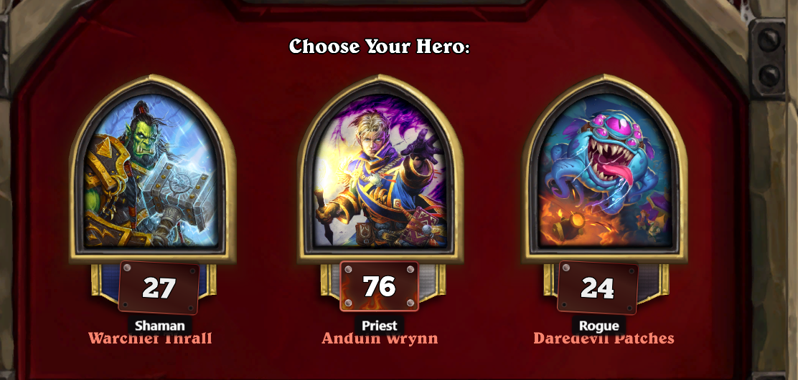
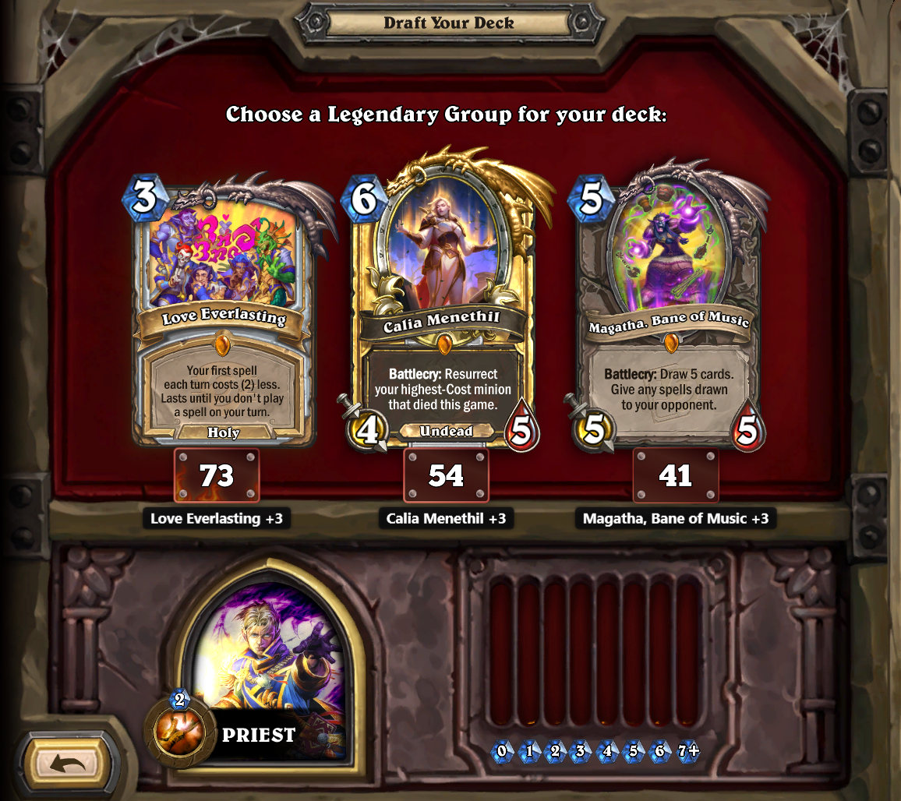
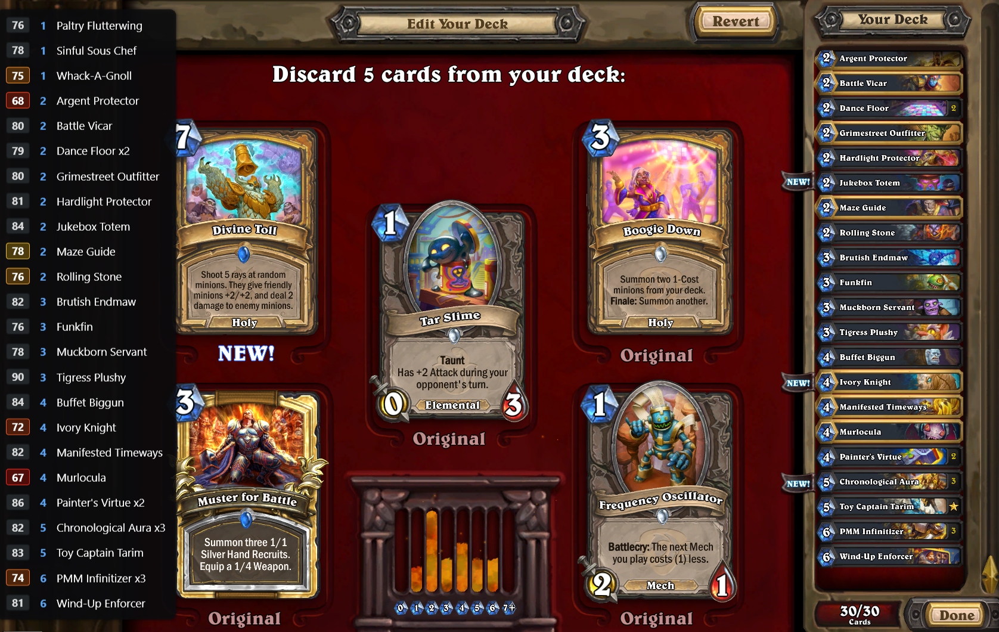

# HDT Arena Helper

[](https://github.com/dokson/HdtArenaHelper/actions/workflows/build.yml)
[](https://github.com/dokson/HdtArenaHelper/releases)
[](./LICENSE)
[](https://hsreplay.net/)

**A free, open-source Hearthstone Arena draft helper — a plugin for
[Hearthstone Deck Tracker](https://hsdecktracker.net/) (HDT).**
During an Arena or Underground Arena draft it reads the three offered cards and shows a
single blended **0–100 score** for each, right in an overlay over the game — then keeps helping
*inside* the match, on Discovers and the mulligan. No subscription, no paywalled data, no account,
no alt-tabbing to a tier list.

It exists to be **a free alternative to the tracker's own freemium arena assistant**, with a
scoring algorithm of its own: open, documented, and fed by more than one data provider.

> **Status: usable, and still moving.** Draft detection, the data pipeline, scoring and the
> overlay are live and verified on a real HDT client — the card draft, the hero pick, the
> Underground Arena legendary groups, the post-loss redraft, and in game the Discover and mulligan
> screens. See the [Roadmap](#roadmap) for what is next.

**Works with:** Arena · Underground Arena · redraft · in-game Discover · mulligan —
Windows, any recent HDT build, free forever.


*The hero pick — every class ranked, with its real arena win-rate in percentage points under
the plaque.*


*Underground Arena's legendary group, scored as the package it is rather than card by card —
and tilted toward the bomb, because this pick is the run's only guaranteed legendary.*


*The post-loss redraft: the whole deck scored and ordered, with the weakest cards flagged so the
five to discard are obvious. It ranks the deck as it stands — cut a card and the row goes.*

## Why this plugin

Hearthstone Deck Tracker is excellent, and its arena assistant is one of its best features —
but it is **freemium**: the draft scores stop when the trial does. Everything else in this
space is either a browser tab you alt-tab to mid-draft, or another subscription. This plugin
does that job **in the client, in real time, for free and forever**, from data anyone can
fetch.

**Free alternative, not a clone.** The scoring is ours: a published win-rate is the input, what
the plugin shows is computed here — class context, sample-size weighting, deck synergy, and an
offline model for what the data has not seen.

Until 0.1.5 a second win-rate feed voted alongside HSReplay, and its author asked us to stop
using it — so we did, the same day. That leaves one measured source, which is a real limitation
and is stated as one: nothing averages away a sampling artefact now. A second source is wanted,
but real arena win-rates are first-party by nature — whoever has them has them because players
upload games — so it is a conversation to have rather than an endpoint to find.

**Built for the player who does not follow the meta.** You should not need to have read a tier
list or memorised the current pool to draft reasonably — nor to know which tribe a class is
quietly full of. The plugin turns that into one number per card, and tells you *why* when
something moved it: the mana slot you are short of, the tribe you have no members for, the
sample size behind the estimate.

**Auditable, not just "objective".** Every score traces back to **published arena win-rates** —
real games won and lost — never to anyone's opinion of a card, ours included. Rules that public
data *cannot* validate are bounded so they only break ties, and the overlay marks them `(exp.)`.
The method, the measurements and the **failures** are written up in
[`REPORT.md`](./HdtArenaHelper.Training/REPORT.md), including ideas that were tried and scored
worse than nothing — so you can audit the number instead of trusting it.

To be equally clear about what this is **not**: the paid assistant has data we do not have, and
we have never benchmarked against it. Nothing here claims to be more accurate than it — only
free, transparent, and honest about its limits.

## Features

- **Live draft detection** — reads the three offered cards (and, in Underground Arena, the
  legendary + package groups) as you draft, via HDT's HearthMirror path.
- **One blended score per card**, 0–100, with a per-source breakdown available:
  - Real arena win-rates from HSReplay's free public arena endpoint.
  - Scored **in your class's context** once the hero is picked (per-class data, falling
    back to the global rate where the class sample is thin).
  - An offline metadata heuristic as a fallback, with weights fit by ridge regression
    against real win-rate data — not hand-tuned.
- **Deck-aware synergy (experimental)** — a bounded +/- from what you already drafted: curve
  gaps, tribal payoffs, weapon and location crowding, spell damage. It breaks ties, never
  overrides a win-rate. Marked `(exp.)` in the overlay because no public data can validate it.
  One exception is allowed to reorder a close pick: a card that is structurally **dead** (a
  tribal payoff with none of its tribe), weighted by how much of your class's deck that tribe
  normally holds.
- **Class / hero picker** — at the hero pick, classes are ranked from the same win-rate data,
  with each class's **estimated arena win-rate in real percentage points** under the plaque.
- **Underground Arena support** — scores the legendary-group pick as the average quality of the
  four cards it adds, and during a post-loss **redraft** shows your whole deck as a scored,
  full-height list so the cards to cut are obvious — a bad start costs you a pick, not the run.
- **In-game Discover scoring** — the same engine, on the cards a Discover offers, in your run
  deck's class context. Beside the score it states what the board makes impossible: a card you
  cannot cast this turn, a minion with no room, and — first, because it is the only irreversible
  one — a full hand, where the discovered card is destroyed outright. Facts in words, never
  points quietly added to the score.
- **Mulligan guidance: tempo × quality, judged against YOUR deck.** What a card does on turns 1-2
  decides the call; how good it actually is decides whether that turn is worth buying. Every
  verdict names the reason: *"plays on turn 2"*, *"a second 2-drop, and the deck holds more"*,
  *"needs a board you do not have on turn 1"*, *"one health — a hero power removes it for free"*,
  *"the Coin turns its Combo on"*, *"nothing plays it before turn 6"*. Most cards get no call at
  all, which is the honest answer and keeps the one that matters visible — and a card nobody has
  enough games on gets silence rather than a guess, because a thinly-measured legendary looks
  average for want of data, not for want of power.
- **Tells you what your deck DOES, on the run screen** — the one between matches: the minion curve,
  how much hard removal against how much damage, AoE, card draw. Counts only, no verdict: you can check
  every one of them against your own deck, which is why it needs no data to be honest.
- **Reads the opponent's HERO POWER at the mulligan**, because a small body dying "for free" is a
  claim about *their* side of the trade. Derived from the hero power CARD rather than the class — an
  Arena hero can be dual-class, and the hero power is what actually kills your minion — only two of
  the eleven basic hero powers answer a one-health body for nothing. Against the classes that must
  swing the hero and take the damage back, the same 2/1 becomes a keep. When the hero power cannot be
  read, the advice stays what it was: a rule is never relaxed on missing data.
- **Stays out of your other games** — the in-game overlay appears only in an actual Arena match,
  so Battlegrounds, ranked and brawls are untouched.
- **Self-updating** — checks this repo's public releases once a day and stages the new build for
  the next restart, keeping the previous one as a one-file rollback.
- **Native look** — hosts HDT's own `ArenaPlaque` control in a scalable overlay, so it
  resizes and DPI-corrects automatically with the game window.
- **Toggleable** — enable/disable and refresh cached data from HDT's Plugins menu; your
  existing native Arenasmith overlay preference is preserved and restored.

## How the score works

```
finalScore(card) = weightedMean( each source's normalized 0–100 score )  +  synergyBonus
```

Each source normalizes its own metric onto a common 0–100 scale, so they blend fairly. Real
arena win-rate drives the score; the offline heuristic is a deliberately weak backstop, because
card metadata alone predicts win-rate only loosely. Two consequences, both measured rather than
assumed: a source's weight shrinks with its sample size for that card, and a card **no** feed has
seen is pulled toward the middle instead of asserting a confident number.

## Install

**Requires Windows and an existing [Hearthstone Deck Tracker](https://hsdecktracker.net/) install**
— no HDT binaries are bundled; the plugin binds to yours at runtime.

1. Grab the latest `HdtArenaHelper-<version>.zip` from
   [Releases](https://github.com/dokson/HdtArenaHelper/releases) — **not** the source zip.
2. Extract the `HdtArenaHelper` folder into `%AppData%\HearthstoneDeckTracker\Plugins\`.
3. In HDT: **Options → Tracker → Plugins**, enable **Arena Helper**.
4. Start an Arena (or Underground Arena) draft — the overlay appears over the offered
   cards automatically.

Use the **Plugins → Arena Helper** menu in HDT to toggle the overlay or force a data refresh.

## FAQ

**Is this an Arena tier list?**
It replaces one. A tier list is a snapshot someone published for a patch and a card pool; this
computes a score per card from current arena win-rates, in your class's context, adjusted for how
many games back it — and re-fetches daily, so it does not go stale between articles. At the hero
pick it also ranks the classes, which is the other thing people open a tier list for.

**Does it work with Underground Arena?**
Yes, and the mode-specific screens too: the legendary-group first pick is scored as a group, and
after a loss the redraft shows your whole deck as a scored list so the cards to cut stand out.

**Does this need a paid subscription (Arenasmith, HSReplay Premium, etc.)?**
No — that is the point of the project. Scoring comes from HSReplay's free public arena data plus
an offline heuristic. Nothing paywalled is used, required, or scraped.

**Does it replace HDT's native Arenasmith overlay?**
It suppresses HDT's native overlay while active so the two don't stack, and restores your
original preference when you disable the plugin — nothing is lost.

**Does it update itself?**
Yes: at most once a day it checks this repo's releases and stages a newer build for your next
HDT restart, keeping the previous one as a rollback. Toggle it, or check by hand, from
**Plugins → Arena Helper**. It fetches only from this project's official releases, over HTTPS.

**Will it pop up during Battlegrounds, ranked or a brawl?**
No — the in-game overlay requires the current match to be an Arena one, so a Battlegrounds
hero pick or a Standard Discover leaves it hidden.

**Is a plugin like this safe to use?**
It reads the client's memory exactly as Hearthstone Deck Tracker itself does — no game
files are modified, no input is automated, nothing is sent anywhere. Same trust boundary as
the tracker you are already running: if you are comfortable with HDT, this adds no new risk
beyond the code itself, which is open and MIT-licensed.

**Is this rembound's "Arena Helper" plugin?**
No — that is an older, unrelated plugin of the same name whose last release was in 2021, built
on a static Lightforge tier list. Different codebase, and this one scores from live win-rate
data instead.

**The overlay doesn't show up over Hearthstone.**
Run Hearthstone in **Windowed** or **Borderless Windowed** mode (Options → Graphics).
In exclusive Fullscreen, Windows composites the game above every other window, so no
overlay — HDT's own included — can draw over it.

**Why is a card unscored / showing a lower-confidence score?**
Very new or very low-sample cards fall back to the offline heuristic (a weaker signal by
design) until enough real arena games exist for a shrinkage-adjusted win-rate.

**Does it consider my drafted deck (synergies, curve, tribes)?**
Yes, conservatively: the bonus is clamped to a few points, so it nudges close calls rather than
deciding picks — these rules cannot be validated against public data the way a win-rate can. The
one exception is a card that is structurally dead in your deck, which may reorder a close pick.

## Roadmap

What shipped is in the [changelog](./CHANGELOG.md). The helper now follows you out of the draft
and into the game — Discover scoring, deck-relative mulligan advice, and board facts stated rather
than scored. What is open now:

- [ ] **Judgement calls that go beyond the rules** ("I am behind, I want removal"). Bounded and
      experimental if it ever lands — there is no public per-game dataset to fit it against, and
      this project's own measurements say an unvalidated number is worse than no number.
- [ ] **Your run, scored as a whole** — the average score of the deck you have drafted, and the same
      for your opponent's deck reconstructed from the cards they actually play. It is the one number
      that says how the *run* is going rather than what to pick next, and everything it needs is
      already on this machine.
- [ ] **Your own numbers** — win-rate by class, by hero and by period, from the game history HDT
      already keeps locally. Nobody else's data, nobody's permission required.
- [ ] **A second win-rate source, if one can be had honourably.** Consensus survives one provider
      going dark; a single feed does not. But real arena win-rates are first-party by nature — whoever
      has them has them because players upload games — so this is a conversation to have, not an
      endpoint to find. See [Data sources](#data-sources--credits).
- [ ] **Sharper thin-sample handling.** Cards nobody has enough games on are the weakest part of
      the score, and the honest fixes are statistical, not cosmetic
      ([REPORT.md](./HdtArenaHelper.Training/REPORT.md) tracks them).

Not planned: **Battlegrounds**. Every number here is an arena win-rate; BG would need a different
data source, a different metric (average placement, MMR-conditioned) and a different model — none
of which this project has, and pretending otherwise is exactly the overclaiming it avoids.

Have an idea or found a bug? Open an [issue](https://github.com/dokson/HdtArenaHelper/issues).

## Contributing

Contributions are welcome — see [CONTRIBUTING.md](./CONTRIBUTING.md) for build/test setup,
code style, and how the heuristic weights are fit and re-trained. Please also read the
[Code of Conduct](./CODE_OF_CONDUCT.md), and [SECURITY.md](./SECURITY.md) to report a
vulnerability.

## Data sources & credits

| Source | What it provides |
|---|---|
| [HSReplay](https://hsreplay.net/) arena API | Real arena win-rate / popularity per card and class (free, public) |
| [HearthDb](https://github.com/HearthSim/HearthDb) (ships with HDT) | Card metadata — costs, statlines, tribes, keywords, text |

The feed is scoped to **Underground Arena** and to recent games (a 4-day window, stated in the
payload itself). So no pre-patch games dilute a score — and if you play normal Arena, the numbers
still come from Underground games, which is a real caveat rather than a detail.

**A source is used only with permission, and dropped the moment it is withdrawn.** Publicly
reachable is not the same as licensed: absent a stated licence the default is no permission, so a
provider gets asked before being added and believed when it says stop. That has already happened
once, and the source was removed the same day — which is also why every source has to stay
individually droppable, with the offline model as the backstop.

## License

[MIT](./LICENSE) — for this project's own code.

It does not cover the Hearthstone card data. The repository also carries a generated copy of the
card list (`docs/CardDatabase.md` and `Generated/CardDatabase.g.cs`) so that contributors can check
a rule against the whole pool without a Hearthstone install. That data comes from HearthDb, whose
**code** is MIT but whose **cards** are extracted from Blizzard's client and carry no licence of
their own: they are Blizzard's, reproduced here as non-commercial fan content under Blizzard's
[Fan Content Policy](https://www.blizzard.com/en-us/legal/fan-content-policy). Neither file is part
of the plugin — it reads the same data from HDT at runtime — and neither is an official or
authoritative card database.

Hearthstone is a trademark of Blizzard Entertainment, Inc. This project is not affiliated with or
endorsed by Blizzard Entertainment or by the Hearthstone Deck Tracker authors.

---

*Fan project. Hearthstone is a trademark of Blizzard Entertainment, Inc. Not affiliated
with or endorsed by Blizzard, HearthSim, HSReplay, or any data provider.*
